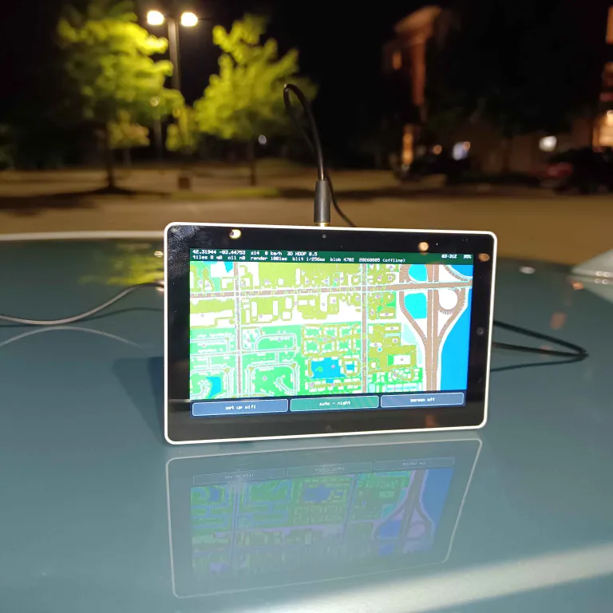

# M5Stack Tab5 M135(GNSS) Protomaps Live Area Map



An offline moving map for the M5Stack Tab5 with the M135 GNSS module. It
draws vector maps from a Protomaps PMTiles archive on the microSD card,
puts your position on them, and keeps working with no network at all.

The tiles are not pictures. They hold road, building and water geometry,
and the device draws them into pixels itself. That is why the same archive
can be rendered in a day palette or a night one without downloading
anything twice.

- Tab5: https://docs.m5stack.com/en/core/Tab5
- GNSS module: https://docs.m5stack.com/en/module/GNSS%20Module
- PMTiles: https://docs.protomaps.com/pmtiles/

A 3D-printable cover for the module:
https://www.printables.com/model/1805013-simple-m5stack-bottom-tab5-m135-gnss


## Where the map comes from

There are two ways to get map data onto the card, and they can be mixed.

**Download the area around you.** With Wi-Fi configured, the device
fetches tiles as it needs them and caches them on the card. A button pulls
in a square around your current position ahead of time, so an area is
stored before you leave the network. The button shows how wide that square
is, and turns green and reads "offline" once everything in it is already
held locally.

**Download the whole planet.** The full Protomaps basemap is about 38 GB
and can be pulled down piece by piece across as many sessions as it takes.
There is also a smaller "world floor" download - every tile from zoom 0 to
zoom 6, 5461 of them - which guarantees the map draws *something* anywhere
on earth. That is what stops a drive out of covered territory ending in a
blank screen. Both downloads record where they got to and resume there.


## What is on screen

**The map**, drawn north-up with your position marked. The marker is blue
when the receiver has a good 3D fix and grey when the position is coarse.
Above about 3 km/h a short needle shows the direction of travel.

**A status bar** along the top with your coordinates, zoom level, speed,
satellite count and HDOP, plus timing and cache counters. It also names
where you are - "Locality, Region" - looked up from the place points in the
archive. The bar changes colour to say how much the position should be
trusted: green for a normal fix, amber for a Wi-Fi estimate or a
questionable one, red when several consistency checks fail together, and
dark red when there is no position yet.

**A row of buttons** along the bottom. From left to right: the area cache,
the day/night palette, place and POI labels, saved points, magnetometer
logging, compass calibration, Wi-Fi positioning, recentring the view, and
turning the screen off.

Labels can be switched on and off instantly, because they are drawn over
the map rather than baked into the tiles.


## Following your position

The map does not keep the marker pinned to the exact centre. It holds it
inside a band in the middle third of the screen and only shifts the view
when the marker reaches the edge of that band. Inside the band the map does
not move at all, so GPS noise moves the dot instead of shuffling the whole
map. That is what lets it keep up in a car without jittering when parked.

You can also drag the map away from your position to look somewhere else.
The marker keeps tracking where you really are and simply leaves the
screen, which is the honest rendering - the map is showing somewhere you
are not. The recentre button lights up while this is true, so a panned view
that nobody remembers panning cannot be mistaken for a live one.


## Position, and how much to trust it

**Faster startup.** The receiver can predict its own satellite orbits about
three days ahead, with no server and no token. Those predictions normally
live in memory backed by a supercapacitor that lasts hours, so they are
saved to the card and pushed back at the next boot. The last known position
is remembered too, and the map is drawn from it during the thirty to ninety
seconds a cold start takes - though no marker appears until something has
actually measured a position.

**Wi-Fi positioning as a fallback.** Every access point the device hears
while it has a good fix is folded into a running average of where the
device was when it heard it. Over enough travel that becomes a rough map of
the radio environment along the routes you take, and when the sky is
blocked - a garage, a tunnel approach, a street between tall buildings - a
scan can be matched against it.

This is an estimate, not a fix, and it is labelled as one. The status bar
reads "WIFI ESTIMATE" with a rough accuracy in metres, the bar turns amber,
and nothing that requires a real fix will accept it. The stored points are
not access point locations: they are averages of where *this device* stood,
so they sit on the roads and paths it travelled rather than on the
transmitters.

**Consistency checks.** A GNSS receiver believes whatever reaches its
antenna, and a nearby transmitter can produce a confident, well-formed and
completely false solution. Nothing in the data stream says "this is not
real". Seven checks look instead for contradictions such a signal would
have to avoid: position moving faster than physics allows, Doppler speed
disagreeing with the change in position, GNSS time disagreeing with the
clock, satellite signal strengths that are implausibly uniform, a
pulse-per-second that is not at 1 Hz, Wi-Fi averages that put you somewhere
else, and altitude that is impossible or frozen.

This is not detection and it refuses nothing. Every one of those checks has
an innocent explanation far more common than an attack - a tunnel exit
looks like a position jump, a cold reacquisition looks like a clock step -
so any single one firing is treated as ordinary. The map keeps drawing
either way. What changes is the colour of the status bar and a short note
naming what is inconsistent. A device that stopped working because it was
suspicious would be worse than one that was quietly lied to: the first
fails every time you drive under a bridge, the second only when someone is
actually attacking you.


## Saved points

Up to 32 named points can be saved and returned to. Choose one as a target
and the map draws a pin and a bearing line toward it, with the distance in
the status bar.

This is deliberately not turn-by-turn navigation. Routing needs a road
network with connectivity, one-way streets and turn restrictions, and the
archive holds drawing geometry - road lines cut at tile edges, with no
recorded connection from one tile to the next. A router built on that would
be wrong in exactly the situations where being right matters. A
straight-line bearing and distance is what an offline device can honestly
offer, and it fails safely: it can be off-road, but it never lies about a
turn.


## Day and night

The palette switches automatically, driven by the sun's actual position
rather than by a clock time. The device has your position from GNSS and the
date from GNSS or the network, which is enough to compute sunrise and
sunset exactly. A fixed clock time would be wrong by hours across a year,
and wrong by more if you travel.

The night palette is not an inversion. Roads stay the brightest thing on
screen because they carry the information, while land and water drop far
enough that the panel is not a lamp, and water stays bluer than land so the
two remain distinguishable at low brightness. The backlight dims as well.

The theme button overrides this to always-day or always-night. It names the
current mode, and in automatic it also shows which way that currently
resolves.


## Compass and logging

The magnetometer is read but not shown as a dial. What it is used for is
correcting the map to true north: magnetic declination is over ten degrees
across much of the continental US, enough that a needle would visibly
disagree with the streets under it.

There is also an optional log, one row per second, of the magnetometer
against the GNSS course, written as CSV to the card. The two agree only
when the device is fixed to something moving in the direction it faces, and
the difference between them is worth modelling offline rather than reading
on a moving screen. Raw and calibration-corrected vectors are both written,
along with the accelerometer, so a fit can be redone later against
different calibration values without another drive. Nothing is logged while
the compass is being calibrated, while the receiver is searching, or below
walking pace - a parked receiver reports an empty course, which would
otherwise fill the file with confident southbound zeroes.

Calibration has its own button and is a deliberate act, because it needs the
device turned through every orientation and a half-finished sweep biases
every reading afterwards.


## Power

The receiver is the largest continuous draw after the screen, and it costs
the same parked as it does at motorway speed. Its solution rate follows
what the map can actually use: once a second at vehicle speeds, once every
two seconds at walking pace, once every five when stationary. The receiver
stays tracking throughout and keeps its ephemeris, so the next reading is a
fix rather than a reacquisition - unlike the module's own low-power modes,
which trade that away.

The screen can be switched off with the button on the right. GNSS keeps
running and tiles keep being fetched onto the card, so a drive with the
display asleep still ends with the route cached; only the drawing stops.
Touching the middle of the screen wakes it. Waking is restricted to the
middle ninth on purpose, so an edge brush against a bag or a leg cannot
light the device up and drain the battery.


## Wi-Fi

Several networks can be remembered. If none is stored, or if you touch the
screen during the first two seconds of startup, the device brings up its own
access point and a setup page - connect a phone to it and any page you open
will redirect there. Credentials are tested before they are saved: the
device actually joins the network and only writes the file if the join
succeeds, because discovering a typo on the next boot is a poor experience
on a device with no keyboard.

The device works entirely offline. Wi-Fi is only needed to download tiles,
to set the clock, and to give the Wi-Fi positioning database something to
listen to.


## Storage limits

Worth reading before formatting a card, because the failure is confusing.

ESP-IDF's FAT driver has exFAT compiled out and offers no setting to turn
it on. A card over 32 GB formatted by Windows or by a camera will be exFAT
and will not mount on either build. The device recognises this and offers to
reformat the card as FAT instead.

There is a second limit beyond that. The ordinary file path is 32-bit
throughout and wraps silently past 4 GB - a 126 GB planet archive reads back
as its own size modulo 2^32 and is rejected as incomplete. The ESP-IDF build
can get past this by calling the filesystem layer directly, provided the FAT
component has been patched for exFAT. The Arduino build cannot, and refuses
such archives with a message naming the limit it hit. See `features.h` for
the details and the switches.


## Building

Two builds from the same sources. The Arduino one is more streamlined; the
ESP-IDF one adds USB stick support, archives larger than 4 GB, and hotplug.

ESP-IDF (5.5.5 at the time of writing; 6.x is not supported by M5Unified):

```
(idf.py set-target esp32p4 || rm -rf build && idf.py set-target esp32p4) \
  && idf.py build flash monitor
```

Arduino:

```
arduino-cli compile --fqbn "esp32:esp32:m5stack_tab5:FlashSize=16M,PSRAM=enabled,PartitionScheme=app3M_fat9M_16MB,CDCOnBoot=cdc,USBMode=hwcdc" . \
  && arduino-cli upload --fqbn "esp32:esp32:m5stack_tab5:FlashSize=16M,PSRAM=enabled,PartitionScheme=app3M_fat9M_16MB,CDCOnBoot=cdc,USBMode=hwcdc" --port /dev/ttyACM0 . \
  && sleep 2 && arduino-cli monitor --port /dev/ttyACM0 --config baudrate=115200
```

If the display fails to come up after a flash, read `DISPLAY_IDF_NOTES.md`
first - that is a known failure with a documented cause. `PROVENANCE.md`
records which constants in this project come from a datasheet or a
specification and which are judgement calls.
